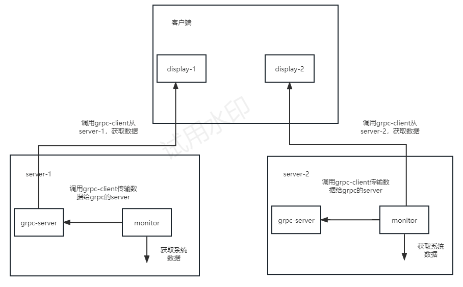

# Monitor

该项目用于实时监控Linux 服务器集群的性能数据。通过五大功能和组件，实现了多台 Linux 服务器性能数据的收集、汇总和传输，以便客户端进行展示和分析。客户端通过远程监控和管理服务器集群，可以集中化地监控和优化服务器资源。

---

## Future

1. 采用gRPC框架实现远程调用，方便对服务器集群进行分布式监控。
2. 更细粒度的监控服务器运行数据，包括CPU每个核心的信息。
3. 采用工厂模式进行信息采集，降低模块间的耦合性，有利于程序的扩展。
4. 采用Shell脚本和Docker进行项目的环境构建，在服务器上可轻量化一键部署。
5. 用QT框架对监控数据进行可视化展示。

## 环境配置

### 安装docker

```shell
sudo apt install curl
curl -fsSL https://test.docker.com -o test-docker.sh
sudo sh test-docker.sh
```

### docker加入用户组

```shell
sudo groupadd docker
sudo usermod -aG docker ${USER}
sudo systemctl restart docker
newgrp docker
docker ps
```

### 构建项目镜像

```shell
cd /docker/build
docker build --network host -f base.dockerfile .
```

查看镜像id，命名镜像id为linux:monitor

```shell
docker images
docker tag xxx linux:monitor
```

### 进入docker容器

```shell
cd docker/scripts
# 启动容器
./monitor_docker_run.sh
# 进入容器
./monitor_docker_into.sh
```

### 编译代码

```shell
cd work/cmake
cmake ..
make
```

## 启动客户端/服务端

### 进入容器

```shell
# 启动容器
./monitor_docker_run.sh
# 进入容器
./monitor_docker_into.sh
```

### 启动服务端

```shell
cd work/cmake/rpc_manager/server
./server
cd work/cmake/test_monitor/src
./monitor
```

### 启动客户端

```shell
cd work/cmake/display_monitor
./display
```

## 目录树

```

├── display_monitor			UI
├── doc					文档说明
├── docker		
│   ├── build
│   │   ├── apt
│   │   └── install
│   │       ├── abseil
│   │       ├── cmake
│   │       ├── grpc
│   │       ├── protobuf
│   │       └── qt
│   └── scripts
├── img
├── proto
├── rpc_manager
│   ├── client
│   └── server
└── test_monitor
    ├── include
    │   ├── monitor
    │   └── utils
    └── src
        ├── monitor
        └── utils
```

## 项目架构



## 说明

[Docker模块](./doc/Docker_module.md)

[Protobuf模块](./doc/protobuf_module.md)

[gRPC模块](./doc/gRPC_module.md)

[Monitor模块](./doc/Monitor_module.md)

[Display模块](./doc/Display_module.md)

## TODO

* [ ] gRPC与Protobuf模块说明
* [ ] 监控日志存储
* [ ] UI可视化优化
